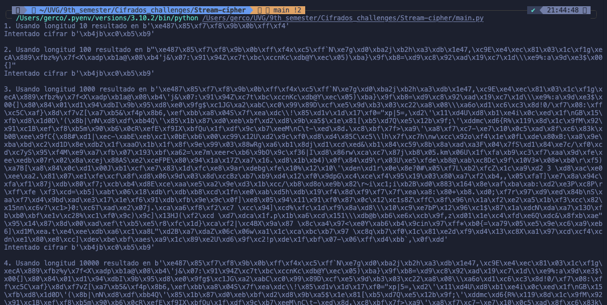

# Stream Cipher
## Parte 01: Implementación de funciones principales

- **Generador de keys:** Se encarga de generar keystreams de forma aletoria con una seed para determinismo.
- **Método de cifrado:** Se encarga de cifrar utilizando un XOR generado.
- **Métodop de descifrado:** Se encarga de generar la función inversa dada la operación y se espera que se utilice la misma clave.

## Parte 02: Análisis de seguridad

### 1. Variación de clave

Esta es una prueba estandar de la generación de claves:
```python
generar_keystream(10101010, 10)
```

Después de realizar un cambio de clave observamos lo siguiente:
```python
generar_keystream(30303030, 10)
```

Resultado:
```python
# Inicial
b'\xf9\x96n)\xfd\xda\x802B\x8c'

# Final
b'\xdd\nO\xc0J\xcdm\xd4\xc4\x04'
```

La generación del keystream cambia debido a que la seed (clave) dicta el comportamiento del algoritmo pseudoaletorio por lo que cambia la clave aunque se requiere una de la misma longitud.

### 2. Reutilización de Keystreams

Cuando se utiliza la misma clave se considera un situación crítica e incluso facil de obtener.

```python
keyRepetida = generar_keystream(101010, 10)
mensaje1 = "ESTE ES EL MENSAJE DE AYER"
mensaje2 = "ESTE ES EL MENSAJE DE HOY"

cifrado1 = cifrar(mensaje=mensaje1, clave=keyRepetida)
cifrado2 = cifrar(mensaje=mensaje2, clave=keyRepetida)

print(f'Cifrado 1: {cifrado1} \nCifrado 2: {cifrado2}')
```

Resultado:
```python
Cifrado 1: b'\xa9_\xd7:\xe8\x12\x85\xbe@o\xda\xb05_\xb8(>Tf\x15C\xb8\xe3\x18\xed*' 
Cifrado 2: b'\xa9_\xd7:\xe8\x12\x85\xbe@o\xda\xb05_\xb8(>Tf\x15C\xb8\xea\x0e\xf1'
```

El **resultado** nos muestra que si de alguna manera las palabras se repiten se puede buscar aquellos mensajes que por frecuencia coincidan como se ve en la impresión. Esta vulnerabilidad se expone cuando un atacante conoce una de las palabras, es decir que conoce una palabra cifrada y una descifrada. Es mucho más fácil por condición en la ecuación que sepa la combinación para descifrar cualquier otro mensaje que utilice la misma clave.

### 3. Longitud del Keystream

La longitud se define a través de un parámetro que crece rápidamente con cada dígito que se le agrega al mismo. Se verifica cual es el comportamiento en el cifrado

```python
def cifrar (mensaje, keystream):
    ...

longitudes = (10, 100, 1000, 10000)
seed = 10101010101010
j = 1
for i in longitudes:
    xK = generar_keystream(seed, i)
    print(f'{j}. Usando longitud {i} resultado en {xK} ')
    print(f'Intentado cifrar {cifrar("PRUEBA", seed)} \n')
    j += 1    
```

Resultado:



Se observa que al cambiar el código de la función para recibir cualquier keystream previamente generada se obtiene exactamente el mismo resultado, esto se debe a la naturaleza de la operacón XOR.

Esto quiere decir que sin importar cual fuese el keystream lo único importante es que sea del mismo tamaño de la palabra a cifrar. Ni más grande, para no generar innecesariamente, ni muy pequeño, para realizar ajustes.